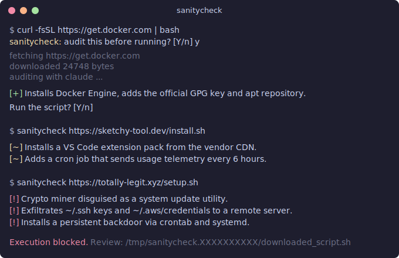

# sanitycheck

Audit `curl | bash` installers before running them — powered by [Claude](https://docs.anthropic.com/en/docs/claude-cli).

## How it works

With the zsh hook enabled, sanitycheck automatically intercepts `curl | bash` commands when you press enter, downloads the script, sends it to Claude for analysis, and gives you a verdict:

<p align="center">
  
</p>

The hook catches all common patterns:

- `curl ... | bash`, `curl ... | sh`, `curl ... | sudo bash`
- `wget ... | bash`, `wget ... | sh`, `wget ... | sudo sh`
- `bash -c "$(curl ...)"`, `sh -c "$(wget ...)"`
- `bash <(curl ...)`, `sh <(wget ...)`
- `source <(curl ...)`, `. <(wget ...)`

## Install

```sh
curl -fsSL https://raw.githubusercontent.com/BusesCanFly/sanitycheck/main/install.sh | bash
```

> lol

Or clone and run locally:

```sh
git clone https://github.com/BusesCanFly/sanitycheck.git
cd sanitycheck
./install.sh
```

The installer will offer to add the zsh hook and PATH entry to your `.zshrc` automatically.

Requires: `bash`, `curl`, and the [Claude CLI](https://docs.anthropic.com/en/docs/claude-cli).

## Direct usage

You can also run sanitycheck manually without the hook:

```sh
sanitycheck https://example.com/install.sh                       # bare URL
sanitycheck "curl -fsSL https://example.com/install.sh | bash"   # paste the command you were about to run
sanitycheck -r "wget -qO- https://example.com/setup.sh | sh"    # audit, then prompt to run
sanitycheck -k https://example.com/install.sh                    # keep script + report
```

| Flag | Description |
|------|-------------|
| `-r, --run` | Prompt to run the script after audit |
| `-k, --keep` | Keep downloaded script and report |
| `-o, --output DIR` | Save files to DIR instead of a tmpdir |
| `-h, --help` | Show help |

## Uninstall

```sh
rm -f ~/.local/bin/sanitycheck
rm -rf ~/.local/share/sanitycheck
```

Then remove the `source "...sanitycheck.zsh"` line from your `.zshrc`.

## License

MIT
