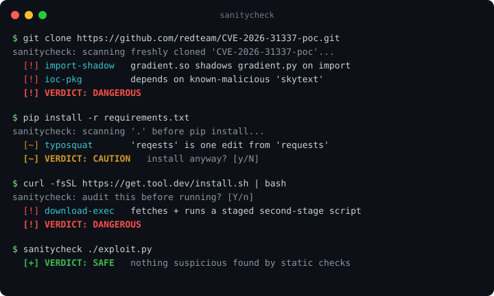

# sanitycheck README

⚠️🚨 This is entirely vibe code slop, but it was useful so I wanted to share 🥀 🚨⚠️

## sanitycheck

Audit untrusted code before you run it. sanitycheck scans `curl | bash` style installers, cloned PoC repos and their dependencies, pip/npm/etc installs, and single scripts for supply-chain trojans and general malware. Then, it gives a `SAFE` / `CAUTION` / `DANGEROUS` verdict. It never runs the code it checks.

The goal is to check for the basics without any need for extra/concious user action. If no warnings are raised, execution follows as normal.

<p align="center">
  
</p>

## Install

```sh
curl -fsSL https://raw.githubusercontent.com/BusesCanFly/sanitycheck/main/install.sh | bash
```

(lol)

Or clone and run locally:

```sh
git clone https://github.com/BusesCanFly/sanitycheck.git
cd sanitycheck
./install.sh
```

The installer adds the shell hook and PATH entry to your `.zshrc` / `.bashrc`, and installs the deep-pass helper and IOC database.

Requires `bash`, `grep`, `find`. `python3` and an LLM provider are optional.

## How it works

With the shell hook enabled, sanitycheck audits automatically when you clone a repo, install dependencies, or `curl | bash`:

| Trigger | Scan |
|---------|------|
| `curl \| bash` command line (zsh) | offers to audit it before it runs |
| `git clone <url>` | **fast** static scan of the fresh checkout |
| `pip` / `pip3` / `npm` / `yarn` / `pnpm` / `poetry` / `uv` install | **deep** scan with dependency resolution; aborts on DANGEROUS |

It picks the analysis from what you're doing, prints the verdict, and never installs, imports, builds, or runs the target.

Clone is fast because dependencies aren't pulled yet and build scripts are already scanned statically; resolution is saved for install, where deps are fetched and the install latency hides the scan. Build commands (`make`, `cargo build`, `go build`, `gradle`) aren't hooked — that's what the clone scan is for.

Core checks are pure shell (`grep`/`find`) and run offline. `python3` (optional) adds AST / typosquat / Unicode analysis, dependency resolution, and `--json`; an LLM (optional) adds a second opinion. Missing pieces are skipped, not fatal.

Enable it yourself (the installer does this for you):

```sh
echo 'source ~/.local/share/sanitycheck/hooks/sanitycheck.zsh' >> ~/.zshrc  # or .bashrc
```

- `SANITYCHECK_HOOK=0 <cmd>` — bypass once (or `command git/pip/...`)
- `SANITYCHECK_HOOK_STRICT=1` — hard-abort on DANGEROUS, no prompt
- `SANITYCHECK_HOOK_FAST=1` — instant, offline hook scans

## What it catches

Supply-chain trojans:

- compiled `.so`/`.pyd` that shadows a same-named `.py` on import; vendored native extensions; IOC file-hash matches
- `setup.py` install hooks, `.pth`/`_distutils_hack` shims, npm lifecycle scripts
- filename gating, DoH/SNI-fronted C2, browser-credential harvesting
- known-malicious, typosquatted, or non-existent (dependency-confusion) packages, including transitive ones

Editor and project autorun:

- VS Code `tasks.json` `runOn: folderOpen`, Visual Studio build events
- `conftest.py`, `sitecustomize.py`, `.envrc` auto-run
- Trojan Source bidi / invisible Unicode

General malware (shell, PowerShell, JS, Ruby, Go, Rust, Makefiles, Dockerfiles):

- reverse shells, download-and-exec, destructive ops, encoded PowerShell, miners, exfil channels, persistence, keyloggers, wallet/credential theft, shellcode runners

Findings are weighted and de-duplicated per file, so a lone `eval()` is `CAUTION`, not `DANGEROUS`.


## Direct usage

You can also run sanitycheck manually, without the hook:

```sh
sanitycheck "curl -fsSL https://example.com/install.sh | bash"   # installer
sanitycheck ./CVE-2026-12345-poc                                 # cloned repo
sanitycheck https://github.com/x/poc.git                         # clone + scan
sanitycheck exploit.py                                           # single file
```

| Flag | Description |
|------|-------------|
| `-r, --run` | After auditing an installer, prompt to run it |
| `--fast` | Static checks only (skip network resolve + LLM) |
| `--offline` | No network at all |
| `--no-llm` | Skip the LLM second opinion |
| `--no-follow` | Don't fetch the staged payloads an installer downloads |
| `--strict` | Exit nonzero on `CAUTION` too (CI gate) |
| `--json` | Machine-readable report |
| `--ioc FILE` | Extra IOC database (repeatable) |
| `-p, --provider P` | LLM provider (`auto`, `ollama`, `claude-api`, `openai`, `claude-cli`) |
| `-m, --model NAME` | Model name |
| `-o, --output DIR` | Keep files in DIR instead of a tmpdir |
| `-k, --keep` | Keep downloaded/extracted files |
| `--no-color` | Disable color |
| `-v, --verbose` | Show LOW findings and progress |
| `-h, --help`, `--version` | Help / version |

Exit codes: `0` SAFE/CAUTION, `1` DANGEROUS, `2` error. `--strict` makes CAUTION exit `1`.

## Dependency & staged-payload resolution

On a repo, sanitycheck walks each dependency's PyPI metadata graph (it never builds or installs — that would run `setup.py`) and flags malicious, typosquatted, or non-existent transitive deps. This catches `frint → skytext` even when the bad package isn't in your manifest.

On an installer, it extracts the URLs the script downloads, fetches each into a scratch dir (bounded, never executed, skipping cloud-metadata and link-local hosts), and scans those too, following stage-2 to stage-3. A server can detect `curl|bash` and serve benign content to a plain fetch, so a clean result here is not proof of safety.

Resolution is capped at ~12s (`SANITYCHECK_RESOLVE_BUDGET`); `--fast`/`--offline`/`--no-follow` turn the network layers off.

## LLM providers

Auto-detected in order; static analysis runs with or without one.

| Provider | Needs | Default model |
|----------|-------|---------------|
| `ollama` | [Ollama](https://ollama.com) installed | `llama3.1` |
| `claude-cli` | [Claude CLI](https://docs.anthropic.com/en/docs/claude-cli) | *(CLI default)* |
| `openai` | `OPENAI_API_KEY` | `gpt-4o` |
| `claude-api` | `ANTHROPIC_API_KEY` | `claude-sonnet-4-5-20250929` |

Override with `--provider`/`--model` or `SANITYCHECK_PROVIDER`/`SANITYCHECK_MODEL`. The `openai` provider honors `OPENAI_BASE_URL` for any OpenAI-compatible API (LM Studio, vLLM, etc.); `ollama` honors `OLLAMA_HOST`.

## IOC database

`iocs/chocopoc.txt` is a tab-separated file of known-malicious package names, file hashes, env markers, C2 strings, and hosts. Add your own with `--ioc <file>` or `SANITYCHECK_IOCS`.

## Testing

```sh
./test.sh
```

A few seconds, offline and deterministic. Unit tests source individual shell functions (input classification, verdict merge, LLM/URL parsing); integration tests scan the inert fixtures in `tests/` and assert on verdict, exit code, and which detections fire — the ChocoPoC chain, general malware, the deep-pass, dev-targeting vectors, evasion variants, and the `git`/`pip`/`npm` hook wrappers. Fixtures never execute (dangerous lines are quoted strings or behind a `raise SystemExit`).

## Limitations

Heuristic and text-based — it reads code, it doesn't sandbox it. A `SAFE` verdict isn't proof of safety and a flagged one isn't proof of malice; read the findings, and run untrusted code in a throwaway VM.

## Uninstall

```sh
rm -f ~/.local/bin/sanitycheck
rm -rf ~/.local/share/sanitycheck
```

Then remove the `source "...sanitycheck.zsh"` line from your `.zshrc`.

## License

MIT
